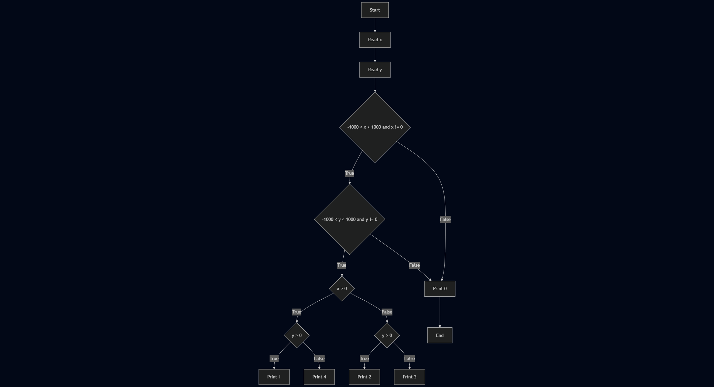
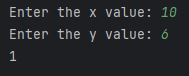
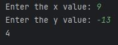
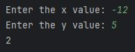
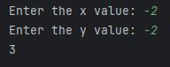
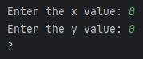

# Act_1-1_Quadrant_Selection

The corresponding quadrant number is printed if the **x** and **y** coordinates are valid.

A question mark (?) is printed if any of the **x** or **y** values are invalid.

## Getting Started

### Install Dependencies
```console
mvn clean install
```

### Input

The first console entry contains an integer **x** such that -1000 < x < 1000 and x != 0.

The second console entry contains an integer **y** such that -1000 < y < 1000 and y != 0.

### Output

The output prints the quadrant in which point (x, y) (1, 2, 3, or 4) is located.

| Sample Input 1 | Sample Output 1 |
|----------------|-----------------|
| 10   6         | 1               |
| 9    -13       | 4               |
| -12  5         | 2               |
| -2   -2        | 3               |
| 0    0         | ?               |

## Workflow

### Flowchart

```
---
title: Quadrant selection example
---
flowchart TD
    A[Start] --> B[Read x]
    B --> C[Read y]
    C --> D{-1000 < x < 1000 and x != 0}
    D -- True --> E{-1000 < y < 1000 and y != 0}
    E -- True --> F{x > 0}
    F -- True --> G{y > 0}
    G -- True --> H[Print 1]
    G -- False --> I[Print 4]
    F -- False --> J{y > 0}
    J -- True --> K[Print 2]
    J -- False --> L[Print 3]
    E -- False --> M[Print 0]
    D -- False --> M[Print 0]
    M --> N[End]
```



### Execution







### References
_Quadrant_. (S/f). Cuemath.com. Retrieved on 12 July 2025 from https://www.cuemath.com/geometry/quadrant/