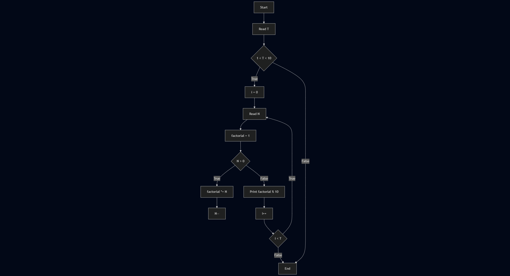
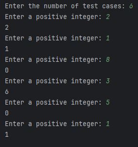

# Act_1-2_Last_Factorial_Digit

A pre-test loop (while) is used to calculate the factorial of the entered number.

The last digit of the factorial is obtained using modular arithmetic (%).

## Getting Started

### Install Dependencies
```console
mvn clean install
```

### Input

The first line of the input data contains the positive integer **T** (1 < T < 10), representing the number of test cases.

The next **T** lines each contain a positive integer **N**.

### Output

For each value of **N**, it prints the last digit of **N!**.

| Sample Input 1 | Sample Output 1 |
|----------------|-----------------|
| 2              | 2               |
| 1              | 1               |
| 8              | 0               |
| 3              | 6               |
| 5              | 0               |
| 1              | 1               |

## Workflow

### Flowchart

```
---
title: Last factorial digit example
---
flowchart TD
    A[Start] --> B[Read T]
    B --> C{1 < T < 10}
    C -- True --> D[i = 0]
    D --> E[Read N]
    E --> F[factorial = 1]
    F --> G{N > 0}
    G -- True --> H[factorial *= N]
    H --> I[N--]
    G -- False --> K[Print factorial % 10]
    K --> L[i++]
    L --> M{i < T}
    M -- True --> E
    M -- False --> N[End]
    C -- False --> N[End]
```


### Execution



### References
_Find First and Last Digits of a Number_. (2017, december 10). GeeksforGeeks. https://www.geeksforgeeks.org/dsa/find-first-last-digits-number/