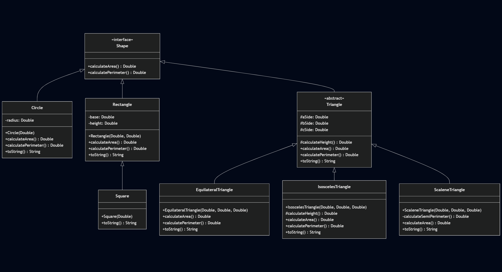
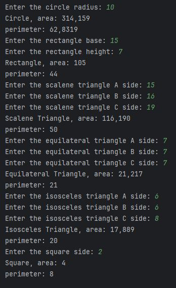

# Act_2_Geometric_Figures

The user is prompted to enter the specified parameters in order to calculate the area and perimeter of each figure.

An interface is implemented as a protocol for the behavior of the figures.

Different concepts are used for superclasses.

## Getting Started

### Install Dependencies
```console
mvn clean install
```

### Input

The first console entry contains the radius of the circle.

The second group of console entries contains the rectangle's base and height.

The third group of console entries contains the scalene triangle's a, b and c sides.

The fourth group of console entries contains the equilateral triangle's a, b and c sides.

The fifth group of console entries contains the isosceles triangle's a, b and c sides.

The last console entry contains the side of the square.

### Output

The output prints the **area** and **perimeter** calculations for each shape.

| Sample Input                                                                         | Sample Output                                    |
|--------------------------------------------------------------------------------------|--------------------------------------------------|
| circle = new Circle(10); circle.toString()                                           | Circle, area: 314.159 perimeter: 62.8319         |
| rectangle = new Rectangle(15,7); rectangle.toString()                                | Rectangle, area: 105 perimeter: 44               |
| scaleneTriangle = new ScaleneTriangle(15,16,19); scaleneTriangle.toString()          | Scalene Triangle, area: 116,190 perimeter: 50    |
| equilateralTriangle = new EquilateralTriangle(7,7,7); equilateralTriangle.toString() | Equilateral Triangle, area: 21,217 perimeter: 21 |
| isoscelesTriangle = new IsoscelesTriangle(6,6,8); isoscelesTriangle.toString()       | Isosceles Triangle, area: 17,889 perimeter: 20   |

## Workflow

### Flowchart

```
---
title: Geometric figures example
---
classDiagram
    class Shape {
        <<interface>>
        +calculateArea() Double
        +calculatePerimeter() Double
    }

    class Circle {
        -radius: Double
        +Circle(Double)
        +calculateArea() Double
        +calculatePerimeter() Double
        +toString() String
    }

    class Rectangle {
        -base: Double
        -height: Double
        +Rectangle(Double, Double)
        +calculateArea() Double
        +calculatePerimeter() Double
        +toString() String
    }

    class Square {
        +Square(Double)
        +toString() String
    }

    class Triangle {
        <<abstract>>
        #aSide: Double
        #bSide: Double
        #cSide: Double
        #calculateHeight() Double
        +calculateArea() Double
        +calculatePerimeter() Double
        +toString() String
    }

    class EquilateralTriangle {
        +EquilateralTriangle(Double, Double, Double)
        +calculateArea() Double
        +calculatePerimeter() Double
        +toString() String
    }

    class IsoscelesTriangle {
        +IsoscelesTriangle(Double, Double, Double)
        #calculateHeight() Double
        +calculateArea() Double
        +calculatePerimeter() Double
        +toString() String
    }

    class ScaleneTriangle {
        +ScaleneTriangle(Double, Double, Double)
        -calculateSemiPerimeter() Double
        +calculateArea() Double
        +toString() String
    }

    Shape <|-- Circle
    Shape <|-- Rectangle
    Rectangle <|-- Square
    Shape <|-- Triangle
    Triangle <|-- EquilateralTriangle
    Triangle <|-- IsoscelesTriangle
    Triangle <|-- ScaleneTriangle
```



### Execution



### References
_Area of Equilateral Triangle_. (S/f). Cuemath.com. Retrieved on 12 July 2025 from https://www.cuemath.com/measurement/area-of-equilateral-triangle/

_Formulas for Isosceles Triangles_. (S/f). Cuemath.com. Retrieved on 12 July 2025 from https://www.cuemath.com/isosceles-triangles-formula/

_Area of Scalene Triangle_. (S/f). Cuemath.com. Retrieved on 12 July 2025 from https://www.cuemath.com/measurement/area-of-scalene-triangle/