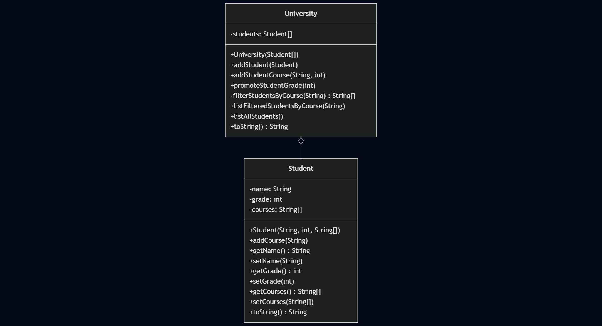
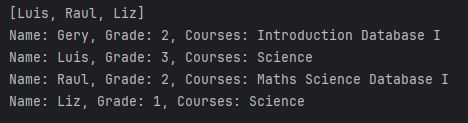

# Act_3_JalaU_Students

The university entity has been created with the following functionalities: loading several students with different courses, adding a new course for each student, promoting a student's grade, and listing students filtered by course. There is also a list showing the total number of students registered in the institution.

It is clear that an instance of the University module will depend on the state or behavior of an instance of the Student module.

## Getting Started

### Install Dependencies
```console
mvn clean install
```

## Workflow

### Flowchart

```
---
title: JalaU students example
---
classDiagram
    class Student {
        -name: String
        -grade: int
        -courses: String[]
        +Student(String, int, String[])
        +addCourse(String)
        +getName() String
        +setName(String)
        +getGrade() int
        +setGrade(int)
        +getCourses() String[]
        +setCourses(String[])
        +toString() String
    }

    class University {
        -students: Student[]
        +University(Student[])
        +addStudent(Student)
        +addStudentCourse(String, int)
        +promoteStudentGrade(int)
        -filterStudentsByCourse(String) String[]
        +listFilteredStudentsByCourse(String)
        +listAllStudents()
        +toString() String
    }

    University o-- Student
```



### Execution



### References
Verma, A. (2017, june 10). _For-each loop in java_. GeeksforGeeks. https://www.geeksforgeeks.org/java/for-each-loop-in-java/

_How Can I Dynamically Add Items to a Java Array?_ (S/f). Stack Overflow. Retrieved on 12 July 2025 from https://stackoverflow.com/questions/5061721/how-can-i-dynamically-add-items-to-a-java-array